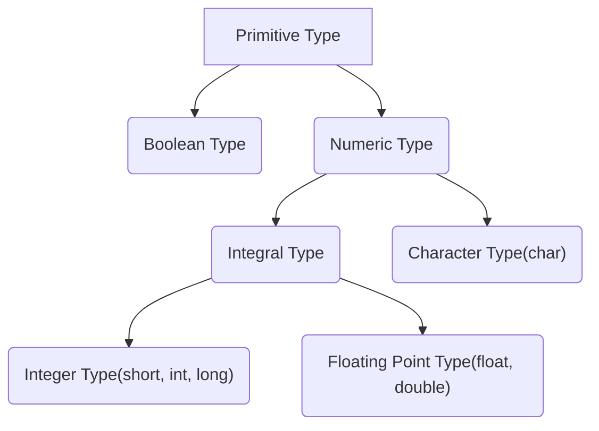
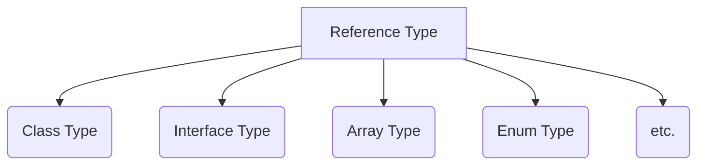

자바의 자료형에는 기본형(Primitive Type)과 참조형(Reference Type)이 있다.

일반적으로 다음과 같이 분류한다

```mermaid
flowchart TD
Pri[Primitive Type]
Pri --> Boo(Boolean Type)
Pri --> Num(Numeric Type)
Num --> Int(Integral Type)
Int --> IntType("Integer Type(short, int, long)")
Int --> Float("Floating Point Type(float, double)")
Num --> CharType("Character Type(char)")
```

```mermaid
flowchart TD
Ref[Reference Type]
Ref --> Class(Class Type)
Ref --> InterFace(Interface Type)
Ref --> Array(Array Type)
Ref --> Enum(Enum Type)
Ref --> etc(etc.)
```
