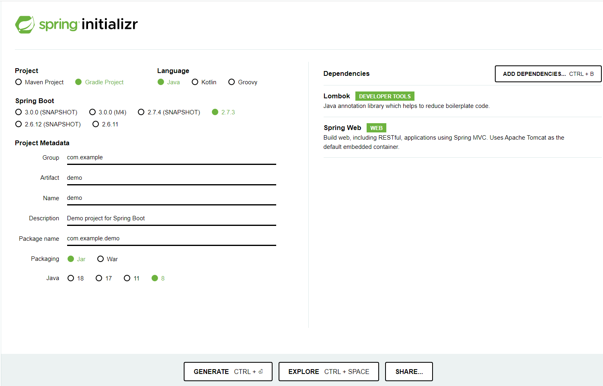

## 개념
### Spring이란
자바 기반의 웹 어플리케이션을 만들 수 있는 프레임워크다

현대 자바 기반의 엔터프라이즈 어플리케이션을 위한 프로그래밍 및 Configuration Model을 제공한다
### Springboot란
Spring을 더 쉽게 이용하기 위한 도구라 불 수 있다

Spring을 이용하여 개발할 때 이것저것 세팅을 해야 하는 요소가 많아 진입 장벽이 존재해 Spring을 처음 배우려는 사람들을 중도에 그만두게 하는 경우가 많다

Springboot는 매우 간단하게 프로젝트를 설정할 수 있게 하여 Spring 개발을 조금 더 쉽게 만들어주는 역할을 한다

## 생성
1. [Spring initializr](https://start.spring.io/) 사이트로 들어간다
2. 원하는 대로 프로젝트를 작성(Dependencies 정보는 추후에 추가로 설정이 가능하나 기본적인 정보들은 추가해서 다운로드 하는 것이 좋다)  
예시)

3. GENERATE 버튼을 눌러 다운로드를 하고 압축을 풀어 개발 툴을 이용해 불러온다
4. 프로젝트가 열리고 그대로 실행하면 콘솔창에  
Tomcat started on port(s): (포트) (http) with context path ''  
가 보일텐데 이제 웹에서 localhost:(포트)로 접속해 다음과 같은 이미지가 뜨면 성공이다  


## 출력
우선 실행파일에 다음과 같은 코드를 입력한다  
```java
import org.springframework.web.bind.annotation.GetMapping;
import org.springframework.web.bind.annotation.RestController;

@RestController
public class TestController {
    @GetMapping("/hello")
    public String returnHelloString(){
        return "Hello";
    }
```
그리고 웹에서 localhost:(포트)/hello로 접속해 다음과 같은 이미지를 볼 수 있다
